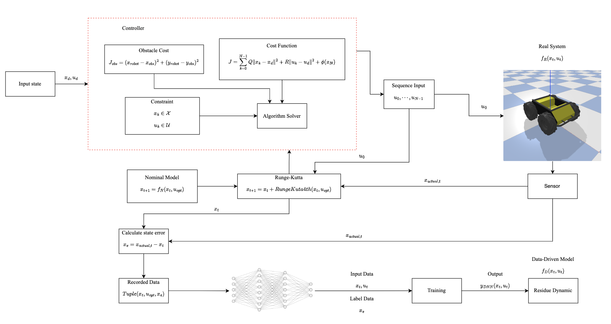

```{r setup, include=FALSE}
knitr::opts_chunk$set(echo = TRUE)
install_and_load <- function(package) {
  if (!require(package, character.only = TRUE)) {
    install.packages(package, dependencies = TRUE)
    library(package, character.only = TRUE)
  }
}
library(plotly)
library(deSolve)
if (!require(reticulate)) install.packages("reticulate")

library(reticulate)

# Install and load necessary package

if (!require(plotly)) install.packages("plotly")
if (!require(htmlwidgets)) install.packages("htmlwidgets")

install_and_load("RefManageR")

# Use reticulate to import numpy
np <- import("numpy")

# Read the .npy files
control_inputs_dnn <- np$load("slide_data/control_inputs_dnn.npy")
control_inputs <- np$load("slide_data/control_inputs.npy")

# Read bibliography
bib <- tryCatch(
  ReadBib("references.bib", check = FALSE),
  error = function(e) {
    warning(paste("Error reading references.bib file:", e$message))
    return(NULL)
  }
)

if (is.null(bib)) {
  stop("Failed to read the bibliography file. Please check if 'references.bib' exists and is correctly formatted.")
}
```

class: center, middle, title-slide

# Model-Based Deep Neural Network to Enhance MPC and MPPI Controller in Dynamics Environment

.ministry[Ministry of Education Youth and Sport]
.department[Department of Electrical and Energy Engineering]

.advisor[SENG Theara]
.author[DIN Sokheng]
.date[28-June-2024]

---

# Table of Contents
.toc[]


---
# Introduction
## Study Background
Deep Neural Networks (DNNs) are particularly efficient in solving data-driven problems. They work by processing a diverse stream of data and fitting it into an optimization problem to uncover hidden patterns within the data. Recent research has shown that DNNs can be effectively used as add-on modules to enhance robot performance in trajectory tracking tasks `r Citet(bib, "zhou2020deep")`.

<div style="text-align: center;">
  
  <p style="text-align: center; font-style: italic;">Figure 1.1 Overview of the proposed approach.</p>
</div>
---
## Objective Of Work
The primary objective of this work is to enhance the accuracy of Model Predictive Control (MPC) algorithms and Model Predictive Path Integral (MPPI) in environments with unknown parameters and dynamic obstacles. This can be archeive by adding Deep Neural Network to improve it. 
The MPC will utilize the Acados library to solve the Nonlinear Optimization Problem (NLP), while the MPPI will be based on the methodologies described in the original paper `r Citet(bib, "Salzmann_2023")`


---
## Scope of Study
The scope of this study include:
+ Implementation Model Predictive Control using Acados
+ Implementation Model Predictive Path Integral using PyTorch
+ Design the core of Deep Neural Network
+ Data Collection Method
+ Implementation Model-Based Deep Neural Network
+ Compare result
---
## Thesis Outline
This thesis is organized as follows:
+ **Chapter 1**: Introduction}Study Background, Objective of Work, Scope of Study and Thesis Outline
+ **Chapter 2**: Design Methodology Model Predictive Control, Model Predictive Path Integral, Deep Neural Network and Model-Based Deep Neural Network
+ **Chapter 3**: Result and Discussion} System Model, System Identification using each controller in Pybullet, Model Predictive Control With Learned Dynamics and Model Path Predictive Integral Control with GPU Accelerate using PyTorch and Learned Dynamics.
+ **Chapter 4**: In Conclusion and Future Work
---
# Design Methodology
## Model Predictive Control
Model Predictive Control (MPC) is an optimal control method, that is currently very popular in Robotics Control System.Model Predictive Control offers a variety value of the control action sequentially over the finite future prediction

<div style="display: flex; justify-content: space-between;">
  <div style="flex: 1; margin-right: 20px;">
    
    <p style="text-align: center; font-style: italic;">Figure 2.1 Prediction horizon.</p>
  </div>
  <div style="flex: 1;">
    
    <p style="text-align: center; font-style: italic;">Figure 2.2 Obstacle avoidance over finite prediction.</p>
  </div>
</div>
---
The system model can be represent as state-space model

$$\dot{x}_{t+1} = f(x(t),u(t))$$
Nonlinear Model Predictive Control also works by solving the quadratic cost subject to the nonlinear function over a future finite horizons. The cost function define as quadratic cost over that prediction horizons.

`$$J(x,u) = \sum_{k=0}^{N-1}(x_{k,ref}-x_{k})^{T}Q(x_{k,ref}-x_{k})+(u_{k,ref}-u_{k})^{T}R(u_{k,ref}-u_{k})$$`
Which

- `\(x \in \mathbb{R}^{nx \times 1}\)` is the state of the system. This shall be obtained from the optimization problem.
- `\(x_{ref} \in \mathbb{R}^{nx \times 1}\)` is the reference state of the system or desired input state.

---
- `\(u \in \mathbb{R}^{nu \times 1}\)` is the input control of the system. This is a solution obtained from the optimization problem.
- `\(u_{ref} \in \mathbb{R}^{nu \times 1}\)` is the reference control of the system or desired input control.
- `\(Q \in \mathbb{R}^{nx \times nx}, R \in \mathbb{R}^{nu \times nu}\)` are the tunable matrix for state and control respectively. It can determine the trade off between the state and control of the system.
---
To solve this problem, we can propose the optimization problem for our system 
`$$\begin{aligned}
    \min_{u_{0}, u_{1}, ..., u_{N-1} } \quad \sum_{k=0}^{N-1}(x_{k, ref}-x_{k})^{T}&Q(x_{k, ref}-x_{k})+(u_{k,ref}-u_{k})^{T}R(u_{k,ref}-u_{k}) + \phi(x_{N})\\
    \text{subject to} \quad & x_{k+1} = f(x_k, u_k) \quad \text{(System dynamics)} \\
    & g(x_k, x_k) \leq 0 \quad \text{(State constraints)} \\
    & h(x_k, x_k) \leq 0 \quad \text{(Input constraints)} \\
    & p(x_k) \leq 0 \quad \text{(Path constraints)} \\
    & x_0=x(0)  \quad \text{(Initial condition)}
\end{aligned}$$`
Notation
- $f$,  $h$  is the system dynamics model and he input constraints of the system respectively.
- $g$, $p$, $\phi(x_N)$ is the state constraints, the path constraint, the terminal cost of the system
---
## Discrete the system model with Runge-Kutta 4th order

<div style="display: flex; justify-content: space-between; align-items: center;">
  <div style="flex: 1; padding-right: 20px;">
     Runge-Kutta  4th order method can be used as an approximator of the system, it enhances the prediction accuracy of the system dynamics within the control horizon of the MPC. This method is more robust than ** Euler-Lagrange **.
    
    `\begin{align*}
    k_1 &= f(t, x, u) \\
    k_2 &= f\left(t + \frac{\Delta t}{2}, x + \frac{\Delta t}{2} \cdot k_1, u\right) \\
    k_3 &= f\left(t + \frac{\Delta t}{2}, x + \frac{\Delta t}{2} \cdot k_2, u\right) \\
    k_4 &= f(t + \Delta t, x + \Delta t \cdot k_3, u) \\
    x(t + \Delta t) &= x(t) + \frac{\Delta t}{6} (k_1 + 2k_2 + 2k_3 + k_4)
    \end{align*}`
  </div>
  
  <div style="flex: 1;">
    ```{r runge-kutta-plot, fig.width=6, fig.height=5, echo=FALSE, message=FALSE, warning=FALSE}
    library(plotly)
    library(deSolve)
    
    # Define the ODE function (example: dy/dt = y^2)
    ode_func <- function(t, y, parms) {
      list(y^2)
    }
    
    # Exact solution
    exact_solution <- function(t) {
      1 / (1 - t)
    }
    
    # Time points
    t <- seq(0, 0.9, by = 0.01)
    
    # Solve using ode function for ode45 (RK4/5) and ode23 (RK2/3)
    parms <- list()  # Empty list as we don't need parameters for this simple ODE
    out_rk45 <- ode(y = 1, times = t, func = ode_func, parms = parms, method = "ode45")
    out_rk23 <- ode(y = 1, times = t, func = ode_func, parms = parms, method = "ode23")
    
    # Euler method (implemented manually)
    euler <- function(y0, t, h) {
      y <- numeric(length(t))
      y[1] <- y0
      for (i in 2:length(t)) {
        y[i] <- y[i-1] + h * y[i-1]^2
      }
      y
    }
    
    out_euler <- euler(1, t, 0.01)
    out_euler_half <- euler(1, t, 0.005)
    
    # Create the plot
    plot <- plot_ly() %>%
      add_lines(x = t, y = exact_solution(t), name = "Exact solution", line = list(color = 'red')) %>%
      add_lines(x = t, y = out_rk45[,2], name = "4th/5th order RK", line = list(color = 'green')) %>%
      add_lines(x = t, y = out_rk23[,2], name = "2nd/3rd order RK", line = list(color = 'blue')) %>%
      add_lines(x = t, y = out_euler_half, name = "Euler (half step)", line = list(color = 'purple')) %>%
      add_lines(x = t, y = out_euler, name = "Euler", line = list(color = 'orange')) %>%
      layout(
        title = "Comparison of Numerical Methods",
        xaxis = list(title = "t"),
        yaxis = list(title = "y", range = c(0, 25)),
        legend = list(x = 0, y = 1, bgcolor = 'rgba(255, 255, 255, 0.5)')
      )
    
    # Display the plot
    plot
    ```
  </div>
</div>
---
## Model Predictive Path Integral
Model Predictive Path Integral(MPPI) is an upgrade control strategy over MPC. It combines the concepts from Model Predictive Control(MPC) and stochastic optimal control. The original paper `r Citet(bib, "williams2017information")` was developed based on the information theoretic that help measure the statistic value of the sampling, that can be matched the optimal control law.
- Objective functionm `\begin{align*}
    x_{t} & \in{\mathbb{R}^{n}} \\
    x_{t+1} &= f(x_{t},v_{t})
\end{align*}`
- Randomly sample input sequence
`\begin{align}
    (v_{0}, v_{1}, ..., v_{T-1}) &= V \in \mathbb{R}^{m \times T} \\
    (u_{0}, u_{1}, ..., u_{T-1}) &= U \in \mathbb{R}^{m \times T} \\
    v_{t} = u_{t} + \epsilon_{t} & \\
    \epsilon_{t} \sim \mathcal{N}(0, \Sigma)
\end{align}`
---
- Cost function
`\begin{align}
    S(V;x_{0}) &= C(\mathcal{H}(V;x_{0})) \\
    C(x_{0}, x_{1}, &\cdots, x_{T}) = \phi(x_{T}) + \sum_{t=0}^{T-1} c(x_{t}) \\
    \mathcal{H}(V;x_{0}) &= (x_{0}, F(x_{0},v_{0}), F(F(x_{0}, v_{0}), v_{1}), \cdots )
\end{align}`
---
- Weight calculation for each sample sequence
`\begin{align} 
    w(V) &= \frac{1}{\eta} \exp\left(
    -\frac{1}{\lambda}\left( S(V) + \lambda(1-\alpha) \sum_{t=0}^{T-1}u_{t}^{T}\Sigma^{-1}(u_{t}+\epsilon_{t}) - \rho \right)
    \right) \\
    \eta &= \sum_{k=1}^{K} \exp \left( 
    -\frac{1}{\lambda} \left( 
    S(U+\varepsilon_{k}) + \lambda(1-\alpha) \sum_{t=0}^{T-1}u_{t}^{T}\Sigma^{-1}(u_{t}+\epsilon_{t}^{k}) - \rho
    \right)
    \right) \\
    \rho &= \min_{k}\left( 
    S(V_{k}) + \lambda(1-\alpha) \sum_{t=0}^{T-1}u_{t}^{T}\Sigma^{-1}(u_{t}+\epsilon_{t}^{k})
    \right)
\end{align}`
- Optimal control input sequence
`\begin{equation}
    u_{t}^{i+1} = u_{t}^{i} + \sum_{k=1}^{K}w(V_{k})\epsilon_{t}^{k}
\end{equation}`
---
## Path Constraint Obstacle Avoidance
To perform obstacle avoidance, it is necessary to have a well understanding of the path constraint or constraint of our optimization problem. The most commonly used method for setting obstacle avoidance in a 2D-plane is by measuring the coordinates $(x, y)$ of the robot with respect to the coordinates $(x, y)$ of the obstacle.
<div style="text-align: center;">
  
  <p style="text-align: center; font-style: italic;">Figure 2.4 Overview of the proposed approach.</p>
</div>
---
- Cost function for path constraint
`\begin{equation}
    \left(x_{\text{robot}}-x_{\text{obstacle}} \right)^{2} + \left(y_{\text{robot}}-y_{\text{obstacle}} \right)^{2} \geq{r^{2} + s^{2}}
\end{equation}
`
Where
- $x_{\text{robot}}, y_{\text{robot}}$ are the current state coordinates of the robot on the $xy$ axis.
- $x_{\text{obstacle}}, y_{\text{obstacle}}$ are the coordinates of the obstacle on the $xy$ axis.
- $r$ and $s$ are defined as the radius of the obstacle and the safe distance between the robot and obstacle, respectively.
---
## Deep Neural Network
Deep Neural Network is an artificial neural network that consists of multiple layers of neurons, also known as nodes or units. Each neuron consist of activation function that take input from the previous neuron mapped into the activation function.
<div style="text-align: center;">
  
  <p style="text-align: center; font-style: italic;">Figure 2.5 Deep Neural Network .</p>
</div>
---
Activation functions play an important role in each neuron, helping to specify the output and reduce the meaningless tolerance error from the previous outputs. The most popular activation function is the Rectified Linear Unit (ReLU), which is defined as:
`\begin{equation*}
    y(x) = max(0, x)
\end{equation*}`
- Classification: Multi-class classification refers to having multiple decisions or values greater than two. The most commonly used activation function for multi-class classification is the Softmax function
  1. Binary Classification
    - Logits: $z = \mathbf{w}^\top \mathbf{x} + b$
    - Sigmoid Activation: $\hat{y} = \sigma(z) = \frac{1}{1 + e^{-z}}$
    - Loss Function (Binary Cross-Entropy $\mathcal{L} = -\left(y \log(\hat{y}) + (1 - y) \log(1 - \hat{y})\right)$
---
  2. Multi-Class Classification: 
    - Logits: $z_i = \mathbf{w}_i^\top \mathbf{x} + b_i$
    - Softmax Activation: $\hat{y}_i = \frac{e^{z_i}}{\sum_{j=1}^C e^{z_j}}$
    - Loss Function (Categorical Cross-Entropy: $\mathcal{L} = -\sum_{i=1}^C y_i \log(\hat{y}_i)$
    
<div style="text-align: center;">
  
  <p style="text-align: center; font-style: italic;">Figure 2.5.2 Deep Neural Network Activation .</p>
</div>
---
## Reinforcement Learning
Reinforcement Learning (RL) is a type of machine learning where an agent learns to make decisions by interacting with an environment. The agent uses a model, which can often be a deep neural network, to represent its behavior and make decisions. In RL, the agent takes actions that lead to transitions between states, with each action associated with a certain probability and resulting in rewards or penalties. The primary goal of the agent is to learn a policy that maximizes the cumulative reward over time.

<div style="text-align: center;">
  
  <p style="text-align: center; font-style: italic;">Figure 2.6Agent learns interacting with environment based on Policy Network .</p>
</div>
---
There are two basic algorithms policy in Rienforcement learning
- Exploitation: This can be described as the agent taking the "greedy" action, where it selects the best-known action for a given state to maximize the immediate reward based on its current knowledge. The purpose of exploitation is to achieve the highest possible reward using the existing learned information.
- Exploration: This involves the agent trying out new actions and states to gather more information about the environment. The agent explores to discover potentially better actions that might lead to higher rewards in the long run. Exploration allows the agent to expand its understanding of the environment, even if it means taking actions that do not immediately yield high rewards. 
---
## Model-Based Deep Neural Network
In control system, basically we have a general mathematics model of the system to design and implement control strategies. This model can represent the system's dynamics and is used to predict its behavior under various conditions. The word of Model-based Deep Neural Network is a key term to improve the dynamics model of the system especially in the unknown or dynamics environment. In Machine Learning above, it can learn the complexity that representation in the data, so it does in using Deep Neural Network is a new revolution in Data-Driven control to improve the quality of the representing model. Integrating Deep Neural Network to improve the flexibility and time response of the system has been proven its abilities in capturing the hidden complex nature of the system from the various data and in disturbance environment
`r Citet(bib, "Salzmann_2023")`, `r Citet(bib, "nagabandi2018learning")`, `r Citet(bib, "gordon2023introducing")`, `r Citet(bib, "aerospace10030209")`
---

## Stage of System Identification

<div style="text-align: center;">
  
  <p style="text-align: center; font-style: italic;">Figure 2.8 Diagram of System identification stage .</p>
</div>
---
## Stage of Concatenating Residual Dynamics
<div style="text-align: center;">
  
  <p style="text-align: center; font-style: italic;">Figure 2.9 Diagram of System concatenating stage .</p>
</div>
---
## Stability Analysis
The Lyapunov function can be used for analyzing the guaranteed stability of the system `r Citet(bib, "ahmadi2011globally")`, especially in our case with a system that uses a trained DNN model. The dynamics of our system can be defined as:
`
\begin{equation}
    x_{t+1} = f_{N}(x_{t},u_{t}) + f_{D}(x_{t},u_{t})
\end{equation}
`
We can use the Lyapunov function to analyze the stability guarantee by denoting the cost function $V(x) = x^{T} P x$ where $P$ is a positive definite matrix `r Citet(bib,"berberich2021data")`. The derivative of the Lyapunov function along with the system trajectories is:
`
\begin{equation}
    \dot{V}(x) = \frac{\partial V}{\partial x} \dot{x} = 2x^{T} P (f_{N}(x_{t},u_{t}) + f_{D}(x_{t},u_{t}))
\end{equation}
`
---
For the nominal system $f_{N}(x_{t},u_{t})$ assume:
`
\begin{equation}
    2x^{T} P f_{N}(x_{t},u_{t}) \leq -\alpha \| x \|^2
\end{equation}
`
for some constant $\alpha > 0$ `r Citet(bib,"berberich2021data")`.
For the data-driven model, assume:
`
\begin{equation}
    \| f_{D}(x_{t},u_{t}) \| \leq \gamma
\end{equation}
`
Combining these two terms, we get:
`
\begin{equation}
    \dot{V}(x) = 2x^{T} P (f_{N}(x_{t},u_{t}) + f_{D}(x_{t},u_{t})) \leq -\alpha \| x \|^2 + 2 \| x^{T} P \| \| f_{D}(x_{t},u_{t}) \|
\end{equation}
`
---
Since $\| x^{T} P \| \leq \beta \| x \|$ for some constant $\beta > 0$, we can write:

`
\begin{equation}
    \dot{V}(x) \leq -\alpha \| x \|^2 + 2 \beta \gamma \| x \|
\end{equation}
`
To ensure stability, the negative term must dominate:

`
\begin{equation}
    -\alpha \| x \|^2 + 2 \beta \gamma \| x \| < 0
\end{equation}
`

This inequality holds if:
`
\begin{equation}
    \alpha \| x \| > 2 \beta \gamma
\end{equation}
`
---
Or equivalently:
\begin{equation}
    \| x \| > \frac{2 \beta \gamma}{\alpha}
\end{equation}

Thus, the system remains stable if:
\begin{equation}
    \| x \| > \frac{2 \beta \gamma}{\alpha}
\end{equation}
From this proof, we see that the system remains stable if the state \( x \) is sufficiently large, ensuring that the contribution from the data-driven model (DNN) does not destabilize the system. This result provides a rigorous condition under which the combined system (nominal model plus DNN) maintains stability `r Citet(bib,"berberich2021data")`.
---
## Setting up robotics inside PyBullet environment
PyBullet is a widely recognized framework among AI, robotics, and control researchers and engineers. The original development was created for the simulation focusing mostly on the surround environment `r Citet(bib,"sadeghi2017sim2real")`. Citet(bib,"mower2022rospybullet")` `r Citet(bib,"panerati2021learning")`. 

<div style="text-align: center;">
  
  <p style="text-align: center; font-style: italic;">Figure 2.10 Robot Arm 5DOF inside Pybullet with depth and semantic camera .</p>
</div>
---
# Result and Discussion
```{r control-inputs-comparison, fig.width=10, fig.height=6, echo=FALSE, message=FALSE, warning=FALSE}
library(plotly)

# Assuming the .npy files contain 2D arrays where each row is a time step
# and each column is a different control input

# Create a sequence for the x-axis (time steps)
time_steps <- seq_len(nrow(control_inputs))

# Create the plot
plot <- plot_ly()

# Add traces for control_inputs
for (i in 1:ncol(control_inputs)) {
  plot <- plot %>% add_trace(
    x = time_steps,
    y = control_inputs[,i],
    name = paste("Control Input", i),
    type = 'scatter',
    mode = 'lines',
    line = list(dash = 'solid')
  )
}

# Add traces for control_inputs_dnn
for (i in 1:ncol(control_inputs_dnn)) {
  plot <- plot %>% add_trace(
    x = time_steps,
    y = control_inputs_dnn[,i],
    name = paste("DNN Control Input", i),
    type = 'scatter',
    mode = 'lines',
    line = list(dash = 'dash')
  )
}

plot <- plot %>% layout(
  title = "Comparison of Control Inputs",
  xaxis = list(title = "Time Step"),
  yaxis = list(title = "Control Input Value", type = "log"),  # Changed to log scale
  legend = list(x = 0.1, y = 0.9)
)

# Display the plot
plot
```
---
## System Model
---
## System Identification using each Controller PyBullet Environment
---
## Design Deep Neural Network
---
## Model Predictive Control with Learned Dyanmcis using Acados
---
## Training the Neural Network
---
## Compare MPC performance nominal model vs learned model
---
## Model Predictive Path Integral Control using PyTorch
---
## Training the Neural Network
---
## Compare MPPI performance nominal model vs learned model
---

# Conclusion and Future Work


---
# References

```{r results='asis', echo=FALSE}
PrintBibliography(bib)