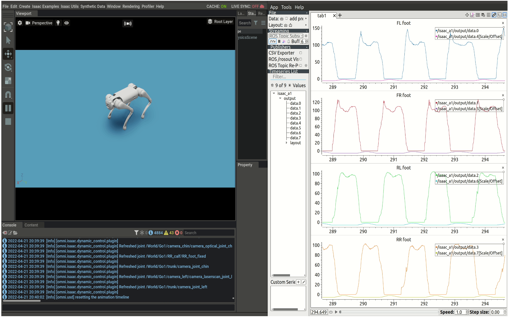

```{r setup, include=FALSE}
knitr::opts_chunk$set(echo = TRUE)
install_and_load <- function(package) {
  if (!require(package, character.only = TRUE)) {
    install.packages(package, dependencies = TRUE)
    library(package, character.only = TRUE)
  }
}
library(plotly)
library(deSolve)

if (!require(reticulate)) install.packages("reticulate")

library(reticulate)
library(kableExtra)
# Install and load necessary package

if (!require(plotly)) install.packages("plotly")
if (!require(htmlwidgets)) install.packages("htmlwidgets")

install_and_load("RefManageR")

# Use reticulate to import numpy
np <- import("numpy")

# Read the .npy files
control_inputs_dnn <- np$load("slide_data/control_inputs_dnn.npy")
control_inputs <- np$load("slide_data/control_inputs.npy")

format_entry <- function(entry) {
  authors <- paste(sapply(entry$author, function(a) paste(a$family, a$given, sep=", ")), collapse = ", ")
  title <- entry$title
  year <- entry$year
  source <- entry$journal %||% entry$booktitle %||% ""
  volume <- entry$volume %||% ""
  number <- entry$number %||% ""
  pages <- entry$pages %||% ""
  doi <- entry$doi %||% ""
  
  formatted <- sprintf("%s. \"%s\". %s. %s%s%s%s%s",
                       authors, title, year,
                       ifelse(source != "", paste0(source, ". "), ""),
                       ifelse(volume != "", paste0("Vol. ", volume, ". "), ""),
                       ifelse(number != "", paste0("No. ", number, ". "), ""),
                       ifelse(pages != "", paste0("pp. ", pages, ". "), ""),
                       ifelse(doi != "", paste0("DOI: ", doi, "."), ""))
  
  return(formatted)
}

split_bib <- function(bib, chunk_size = 4) {
  total_refs <- length(bib)
  chunks <- ceiling(total_refs / chunk_size)
  
  for (i in 1:chunks) {
    start <- (i-1) * chunk_size + 1
    end <- min(i * chunk_size, total_refs)
    
    if (i != 1) {
      cat("\n---\n\n")
    }
    
    for (j in start:end) {
      entry <- bib[[j]]
      formatted_entry <- format_entry(entry)
      cat(sprintf("[%d] %s\n\n", j, formatted_entry))
    }
  }
}

# Read bibliography
bib <- tryCatch(
  ReadBib("references.bib", check = FALSE),
  error = function(e) {
    warning(paste("Error reading references.bib file:", e$message))
    return(NULL)
  }
)

if (is.null(bib)) {
  stop("Failed to read the bibliography file. Please check if 'references.bib' exists and is correctly formatted.")
}
```

class: center, middle, title-slide

# Model-Based Deep Neural Network to Enhance MPC and MPPI Controller in Dynamics Environment

.ministry[Ministry of Education Youth and Sport]
.department[Department of Electrical and Energy Engineering]

<div class="info-group">
  <div class="advisor">SENG Theara</div>
  <div class="author">DIN Sokheng</div>
  <div class="date">09 July 2024</div>
</div>

---

# Table of Contents
.toc[]


---
# Introduction
Study Background
This thesis integrates Deep Neural Networks with Model Predictive Control and Model Predictive Path Integral to enhance control accuracy in dynamic environments, addressing challenges with deep learning techniques and advanced robotics control.

<div style="text-align: center;">
  
  <p style="text-align: center; font-style: italic;">Figure 1.1 Overview of the proposed approach.</p>
</div>
---
# Design Methodology
## Model Predictive Control
Model Predictive Control (MPC) is an optimal control method that is currently very popular in robotics control systems. 
Model Predictive Control offers a variety of control actions sequentially over a finite future prediction horizon.

<div style="display: flex; justify-content: space-between;">
  <div style="flex: 1; margin-right: 20px;">
    
    <p style="text-align: center; font-style: italic;">Figure 2.1 Prediction horizon.</p>
  </div>
  <div style="flex: 1;">
    
    <p style="text-align: center; font-style: italic;">Figure 2.2 Obstacle avoidance over finite prediction.</p>
  </div>
</div>
---
## Model Predictive Path Integral
Model Predictive Path Integral(MPPI) is an upgrade control strategy over MPC. It combines the concepts from Model Predictive Control(MPC) and stochastic optimal control. The original paper `r Citet(bib, "williams2017information")` was developed based on the information theoretic that help measure the statistic value of the sampling, that can be matched the optimal control law.
<div style="text-align: center;">
  
  <p style="text-align: center; font-style: italic;">Figure 2.4 MPPI Prediction and Sampling .</p>
</div>
---
## Discrete the system model with Runge-Kutta 4th order
The Runge-Kutta 4th order method can be used as an approximator of the system, enhancing the prediction accuracy of the system dynamics within the control horizon of the MPC.

<div style="flex: 1; text-align: center;">
            
            <p style="font-style: italic;">Figure 2.3 Runge-Kutta 4th order approximator.</p>
        </div>
---
## Path Constraint Obstacle Avoidance
To perform obstacle avoidance, it is necessary to have a well understanding of the path constraint or constraint of our optimization problem. The most commonly used method for setting obstacle avoidance in a 2D-plane is by measuring the coordinates $(x, y)$ of the robot with respect to the coordinates $(x, y)$ of the obstacle.
<div style="text-align: center;">
  
  <p style="text-align: center; font-style: italic;">Figure 2.5 Overview of the proposed approach.</p>
</div>
---
## Stage of System Identification
<div style="text-align: center;">
  
  <p style="text-align: center; font-style: italic;">Figure 2.6 Diagram of Data Collection Process .</p>
</div>
---
## Stage of System Identification
<div style="text-align: center;">
  
  <p style="text-align: center; font-style: italic;">Figure 2.7 Diagram of Training Process .</p>
</div>
---
## Stage of Concatenating Residual Dynamics
<div style="text-align: center;">
  
  <p style="text-align: center; font-style: italic;">Figure 2.8 Diagram of fusing Nominal Model with Data-driven model .</p>
</div>
---
# Result and Discussion

## Model Predictive Control with Learned Dyanmcis using Acados
**Training Neural Network**
<div style="text-align: center;">
  
  <p style="text-align: center; font-style: italic;">Table 3.1 Training loss compare to MLP, ResNet18, ResNet50.</p>
</div>
---
**Compare MPC performance nominal model vs learned model** <br>
<div style="display: flex; justify-content: space-between;">
  <div style="flex: 1;">
    
    <p style="text-align: center; font-style: italic;">Figure 3.3 State Errors without DNN.</p>
  </div>
  <div style="flex: 1;">
    
    <p style="text-align: center; font-style: italic;">Figure 3.4 State Errors with DNN.</p>
  </div>
</div>
---
**Compare MPC performance nominal model vs learned model** <br>
<div style="max-width: 1000px; margin: 0 auto;">
  <div style="display: flex; justify-content: space-between; gap: 20px;">
    <div style="flex: 1; display: flex; flex-direction: column; align-items: center;">
      <div style="width: 100%; padding-top: 75%; position: relative; overflow: hidden;">
        
      </div>
      <p style="margin-top: 10px; font-style: italic; text-align: center;">Figure 3.5: Nominal Model</p>
    </div>
    <div style="flex: 1; display: flex; flex-direction: column; align-items: center;">
      <div style="width: 100%; padding-top: 75%; position: relative; overflow: hidden;">
        
      </div>
      <p style="margin-top: 10px; font-style: italic; text-align: center;">Figure 3.6: Nominal with Data-Driven Model</p>
    </div>
  </div>
</div>
---
</div>
<div class="video-container">
  <div class="video-wrapper">
    <video width="100%" height="400" controls autoplay muted loop>
      <source src="videos/diff_mpc_bullet.mp4" type="video/mp4">
      Your browser does not support the video tag.
    </video>
    <p style="margin-top: 10px; font-style: italic; text-align: center;">Nominal Model</p>
  </div>
<div class="video-wrapper">  
  <video width="100%" height="400" controls autoplay muted loop playsinline>
    <source src="videos/diff_mpc_dnn_bullet.mp4" type="video/mp4">
    Your browser does not support the video tag.
  </video>
  <p style="margin-top: 10px; font-style: italic; text-align: center;">Nominal with Data-Driven Model</p>
</div>
<script>
document.currentScript.previousElementSibling.querySelector('video').playbackRate = 3;
</script>
</div>

---
## Model Path Predictive Integral Control with GPU Accelerate using PyTorch
**Training Neural Network**
<div style="text-align: center;">
  
  <p style="text-align: center; font-style: italic;">Table 3.2 Comparison of DNN Training Loss for MPPI.</p>
</div>
---
**Compare MPPI performance nominal model vs learned model**

<div style="display: flex; justify-content: space-between;">
  <div style="flex: 1;">
    
    <p style="text-align: center; font-style: italic;">Figure 3.5 State Errors without DNN.</p>
  </div>
  <div style="flex: 1;">
    
    <p style="text-align: center; font-style: italic;">Figure 3.6 State Errors with DNN.</p>
  </div>
</div>
---
**Compare MPPI performance nominal model vs learned model**
<div style="display: flex; justify-content: space-between;">
  <div style="flex: 1;">
    
    <p style="text-align: center; font-style: italic;">Figure 3.8 State reference and state feedback using Nominal Model</p>
  </div>
  <div style="flex: 1;">
    
    <p style="text-align: center; font-style: italic;">Figure 3.9 State reference and state feedback using Nominal Model fused with Data Driven Model</p>
  </div>
</div>
---
**Compare MPPI performance nominal model vs learned model**
<div style="display: flex; justify-content: space-between;">
  <div style="flex: 1;">
    
    <p style="text-align: center; font-style: italic;">Figure 3.10 Input Control of Nominal Model</p>
  </div>
  <div style="flex: 1;">
    
    <p style="text-align: center; font-style: italic;">Figure 3.11 Input Control of Nominal Model fused with Data Driven Model</p>
  </div>
</div>
---
</div>
<div class="video-container">
  <div class="video-wrapper">
    <video width="100%" height="400" controls autoplay muted loop>
      <source src="videos/diff_mppi_bullet.mp4" type="video/mp4">
      Your browser does not support the video tag.
    </video>
  </div>
  <div class="video-wrapper">  
    <video width="100%" height="400" controls autoplay muted loop>
      <source src="videos/diff_mppi_dnn_bullet.mp4" type="video/mp4">
      Your browser does not support the video tag.
    </video>
  </div>
</div>
---
# Conclusion and Future work
** Conclusion ** <br>
The study presents a high-performance control approach combining Deep Neural Networks with Model Predictive Control (MPC) and Model Predictive Path Integral (MPPI). This method effectively captures complex system dynamics in noisy environments, outperforming traditional nominal equation-based control. While the approach shows significant potential, it currently requires substantial computational resources.
---
** Future Work ** 
Future development should focus on deploying this technique in real-time hardware, utilizing simulation tools like Nvidia's Omniverse for data collection, and implementing it on GPU-enabled devices such as Nvidia's Jetson and ROS2 framework for practical robotic applications.
<div style="display: flex; justify-content: space-between;">
  <div style="width: 32%; text-align: center;">
    
    <p>Omnivere Simulation SDK</p>
  </div>
  <div style="width: 32%; text-align: center;">
    
    <p>NVIDIA Jetson Nano</p>
  </div>
  <div style="width: 32%; text-align: center;">
    
    <p>ROS Iron Irwin</p>
  </div>
</div>
---
# thankyou
<style>
.thankyou-slide { --thankyou-margin-top: 30vh; }
</style>
Thank you for your attention
---
# References
```{r results='asis', echo=FALSE}
split_bib(bib, chunk_size = 4)
```
---

# Appendix
<div style="display: flex; justify-content: space-between; font-size: 0.9em;">
  <div style="width: 48%;">
    <p style="text-align: center; font-weight: bold; font-size: 1em;">Runge-Kutta Method</p>
    \begin{align*}
    \scriptsize
    k_1 &= f(t, y) \\
    k_2 &= f\left(t + \frac{\Delta t}{2}, y + \frac{\Delta t}{2} \cdot k_1\right) \\
    k_3 &= f\left(t + \frac{\Delta t}{2}, y + \frac{\Delta t}{2} \cdot k_2\right) \\
    k_4 &= f(t + \Delta t, y + \Delta t \cdot k_3) \\
    y(t + \Delta t) &= y(t) + \frac{\Delta t}{6} (k_1 + 2k_2 + 2k_3 + k_4)
    \end{align*}
  </div>
  <div style="width: 48%;">
    <p style="text-align: center; font-weight: bold; font-size: 1em;">Obstacle Avoidance</p>
    \begin{equation*}
    \scriptsize
    \left(x_{\text{robot}}-x_{\text{obstacle}} \right)^{2} + \\
    \left(y_{\text{robot}}-y_{\text{obstacle}} \right)^{2} \geq{r^{2} + s^{2}}
    \end{equation*}
  </div>
</div>
---
<div style="display: flex; justify-content: space-between; width: 90%; font-size: 0.9em;">
  <div style="width: 48%;">
    <p style="text-align: center; font-weight: bold; font-size: 1em;">MPC</p>
    \begin{align*}
    \scriptsize
    \min_{u_{0:N-1}} &\sum_{k=0}^{N-1}(x_{k,ref}-x_{k})^TQ(x_{k,ref}-x_{k})+ \\
    &(u_{k,ref}-u_{k})^TR(u_{k,ref}-u_{k}) + \phi(x_N) \\[6pt]
    \text{s.t.:} \quad & x_{k+1} = f(x_k, u_k) \\
    & g(x_k, x_k) \leq 0 \\
    & h(x_k, x_k) \leq 0 \\
    & p(x_k) \leq 0 \\
    & x_0 = x(0)
    \end{align*}
  </div>
  <div style="width: 48%;">
    <p style="text-align: center; font-weight: bold; font-size: 1em;">MPPI</p>
    \begin{align*}
    \scriptsize
    w(V) &= \frac{1}{\eta} \exp\left(
    -\frac{1}{\lambda}( S(V) + \lambda(1-\alpha) \sum_{t=0}^{T-1}u_{t}^T\Sigma^{-1}(u_{t}+\epsilon_{t}) - \rho )
    \right) \\[6pt]
    \eta &= \sum_{k=1}^{K} \exp \left( 
    -\frac{1}{\lambda}( 
    S(U+\varepsilon_{k}) + \lambda(1-\alpha) \sum_{t=0}^{T-1}u_{t}^T\Sigma^{-1}(u_{t}+\epsilon_{t}^k) - \rho
    )
    \right) \\[6pt]
    \rho &= \min_{k}( 
    S(V_{k}) + \lambda(1-\alpha) \sum_{t=0}^{T-1}u_{t}^T\Sigma^{-1}(u_{t}+\epsilon_{t}^k)
    ) \\[6pt]
    u_{t}^{i+1} &= u_{t}^{i} + \sum_{k=1}^{K}w(V_{k})\epsilon_{t}^k
    \end{align*}
  </div>
</div>